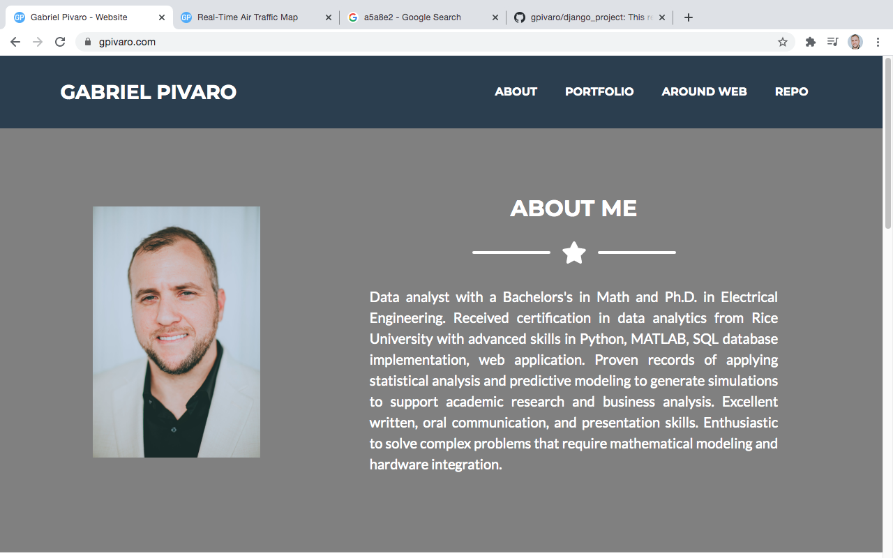
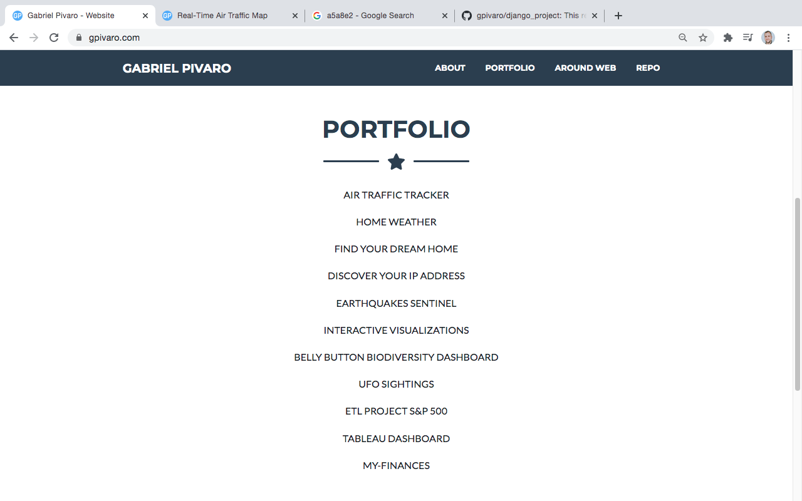

# My Personal Website using Django

This repository has code used to build my personal website using the Django framework

This website is build based on the following tutorial:
<ul>
<li>
  
  </li>

<li>[Build a Resume Website With Python and Django](https://www.youtube.com/watch?v=F5WXNI3Dq8U&t=629s)</li>

<li>[Django Plotly Dash Tutorial How to Connect Dashboards & Graphs into a Python Full Stack Application](https://www.youtube.com/watch?v=psvU4zwO3Ao)</li>
</ul>
